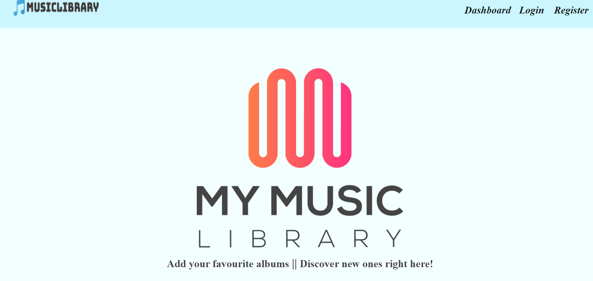
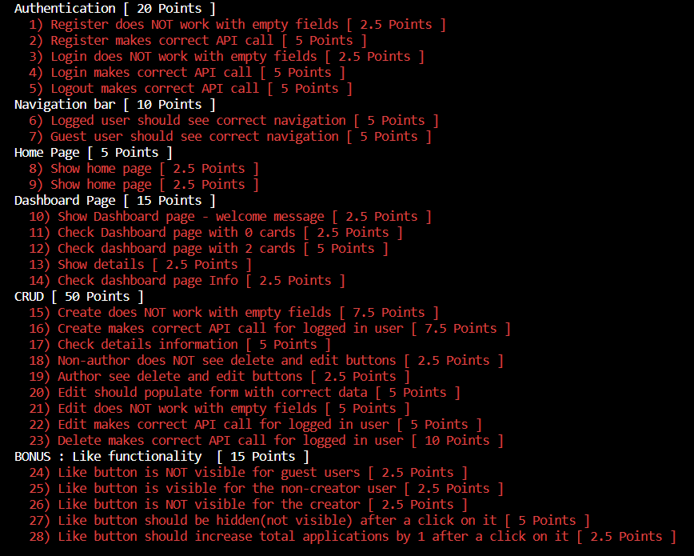

# Music Library
**Music Library** is a front-end app(*SPA*) for creating and managing music albums. The app allows visitors to browse through the given catalog. Users may 
register with an **email** and **password**, which allows them full access to the site's features. They can also **edit** or **delete** a created album card.



## Pages and Permissions

- All users
- - Home
- - Dashboard
- - Details (id)
- - Login
- - Register


- Authenticated users
- - Dashboard
- - Create
- - Album Details (id)
- - Edit Album (id) - Owner only
- - Delete Album (id) - Owner only

---

## Getting Started

Follow these simple steps to get started:

1.**Clone the repository on your local machine**

git clone https://github.com/username/Softuni-Svetlina-Music-Library.git

2. **Install the dependencies**:

   npm install npm

3. **Start the app**:

   npm start

   ---
## REST API

Once the application is started, the REST API is available at:
```
http://localhost:3300/api-docs
```

The endpoint definitions are as follows:
- GET /data/albums?sortBy=_createdOn%20desc
- GET /data/albums/:id
- POST /data/albums 
-  - body: ```{ singer: string, album: string, imageUrl: string, release: number, label: string, sales: string }```
- PUT /data/albums/:id
- DELETE /data/albums/:id
- POST /users/login 
- - body: ```{ email: string, password: string }```
- POST /users/register
- GET /users/logout
- POST /data/likes 
- - body: ```{ albumId: string }```
- GET /data/likes?where=albumId%3D%22:albumId%22%20&distinct=_ownerId&count

  ## RUNNING TESTS
  You can run npm tests on the project, which can be done as follows:
  
  1.Open the terminal in your desired IDE
  
  2.Run this command:
  ```sh
  npm run test

3.Once this is finished, you should receive something like this:

